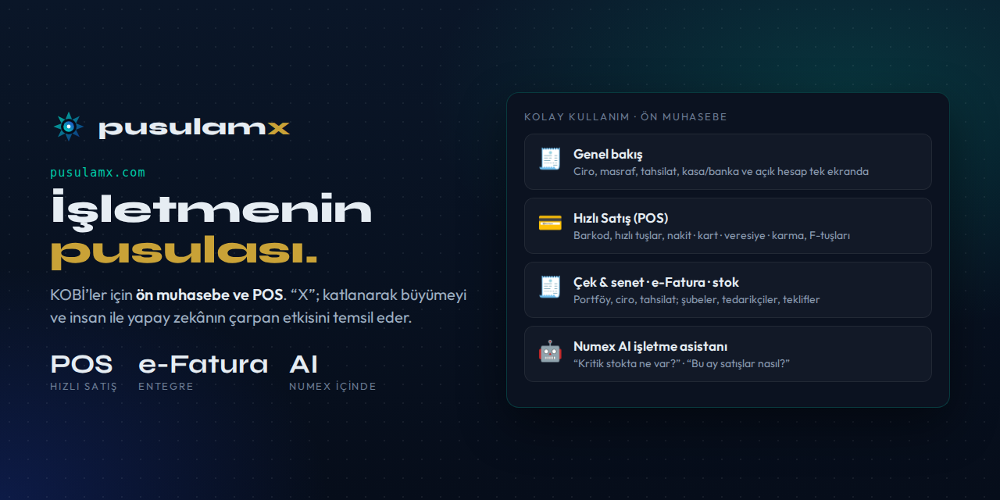
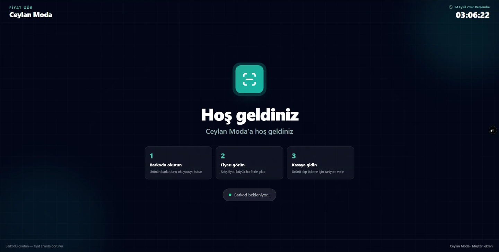
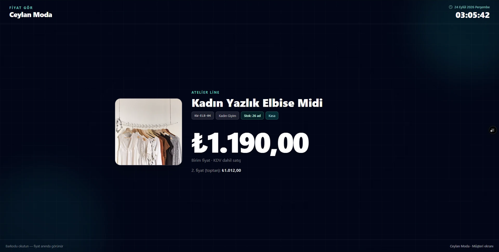
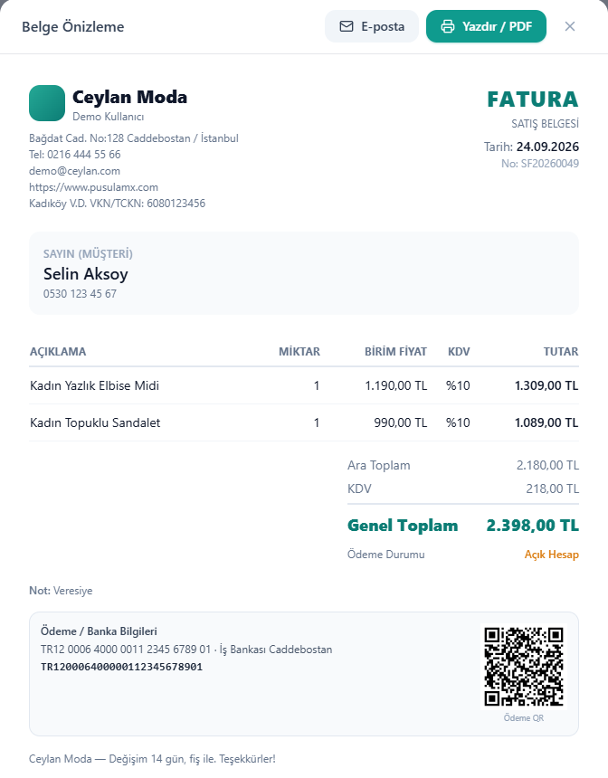
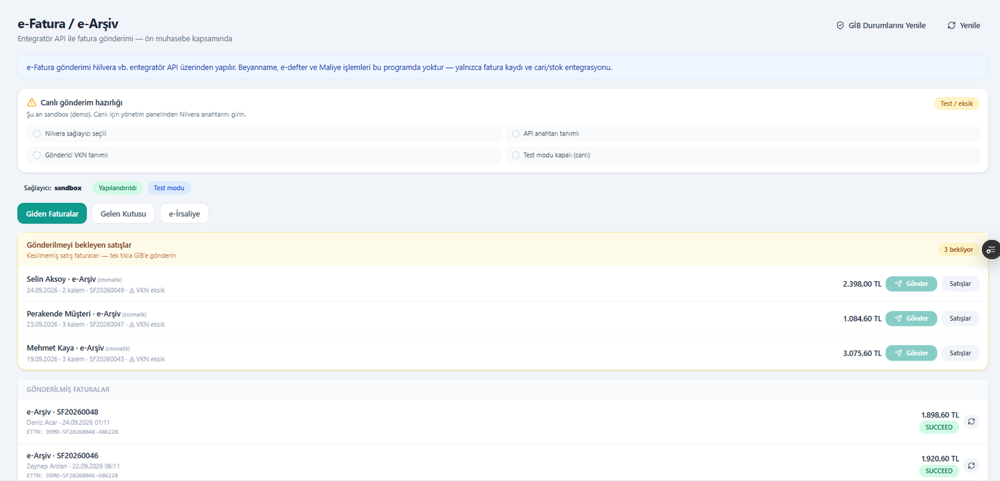
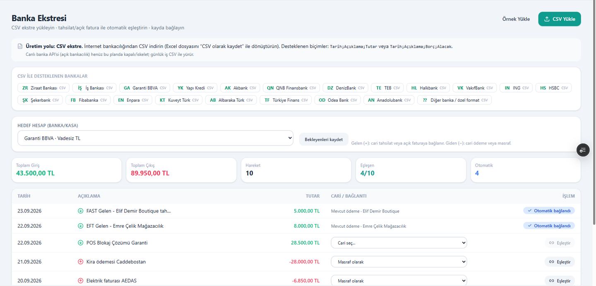
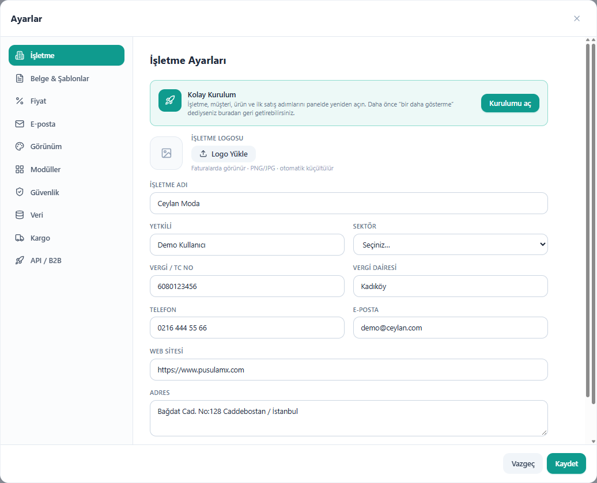
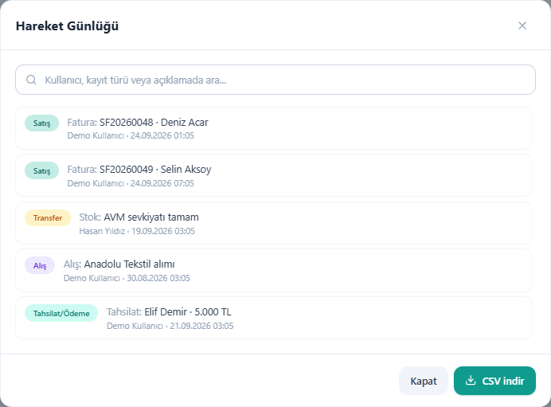
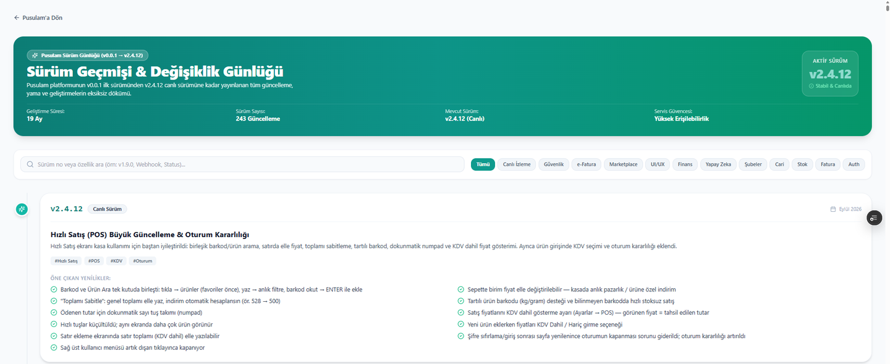
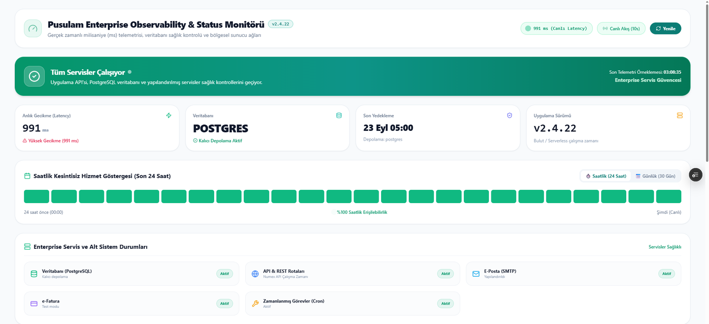

# 🧭 Pusulam

### İşinizi tek ekrandan, kolayca yönetin.

*İşletmenizin pusulası — net, hızlı, bulutta.*

**Esnaf ve KOBİ'ler için ön muhasebe, hızlı satış (POS), e-Fatura, stok ve pazaryeri entegrasyonu — içinde Numex AI.**

---

> *Karışık muhasebe programlarına ve Excel dosyalarına saatlerinizi harcamayın. Satış yapın,
> e-fatura kesin ve tüm stoklarınızı saniyeler içinde takip edin.*

**Karmaşık bir ERP değil; günlük işi hızlandıran, anlaşılır ön muhasebe.**
✅ 7 gün ücretsiz · ✅ Kredi kartı gerekmez · ✅ Anında kurulum · ✅ Demo ile incele

"Pusulam", işletmenin rotasını güvenle bulmasını sağlayan rehberliği; isimdeki **X** ise katlanarak
büyümeyi ve insan ile yapay zekânın çarpan etkisini temsil eder. Pusulam, [Numex AI](https://numexai.com.tr)
ekibinin ürünüdür.

## 🧭 Gerçek Kuzey

Ticaretin karmaşık, hızlı ve bazen belirsiz sularında ilerlerken işletmelerin en çok ihtiyaç duyduğu
şey **netlik ve yöndür**. Pusulam tam da bu ihtiyaca cevap vermek için doğdu. Amacı sadece bir
muhasebe yazılımı olmak değil; esnaf, KOBİ ve kurumsal şirketlerin büyüme yolculuğunda onlara her
zaman *"Gerçek Kuzey"*i gösteren, sapmaları engelleyen ve hedefe ulaştıran güvenilir bir rehber olmak.

> ***"Karmaşıklığı sadeleştiriyor, rotanızı güvence altına alıyoruz."***

## 👥 Kimler için?

**KOBİ'ler, esnaf ve serbest çalışanlar:** dükkân, atölye, perakende ve hizmet işletmeleri.
Mağaza/perakende (kasa odaklı) ve toptan/bayi (açık hesap ve belge ağırlıklı) çalışma şekillerinin
ikisine de uygun; aynı stok, iki satış kanalı.

| Kapsamda ✅ | Kapsam dışı ❌ |
|---|---|
| Gelir-gider, cari, stok, kasa, banka, çek-senet, raporlar | Resmi beyanname |
| Satış/alış faturası, teklif, PDF; e-Fatura/e-Arşiv (entegratör API ile) | e-Defter |
| POS, pazaryeri entegrasyonları, basit bordro/avans kaydı | Maliye işlemleri, SGK/e-bordro |

Resmi işlemler için mali müşavirinizle çalışmaya devam edersiniz; Pusulam'daki **Muhasebeci Ağı**
bu iş birliğini kolaylaştırır.

> 💡 **Demo hesabıyla incele:** Hiç veri girmeden örnek bir işletme üzerinde uygulamayı hemen dene.

## 🤝 Numex AI ekibi tarafından

**PusulamX, [Numex AI](https://numexai.com.tr) ekibi tarafından kurulmuştur.** Pusulam,
**Mehmet Ali Ceylan'ın 6 yıllık vizyoner projesi** olarak doğdu ve **Aralık 2024**'te ilk commit'iyle
(v0.0.1) Numex AI mühendislik ekibi tarafından hayata geçirildi: ilk sürüm taslağı, veri mimarisi ve
uygulama şablonu. O günden bu yana **243 güncelleme** ile bugünkü v2.4.22'ye ulaştı. İsimdeki **X**, ana
şirket Numex AI'ın felsefesinden gelir: katlanarak büyüme ve insan ile yapay zekânın çarpan etkisi.
*Amaç işletmenizi sadece yönetmek değil, "X" çarpanıyla büyütmek.*

- 💡 **Özellik talebi:** Olması gereken bir özellik mi var? Yazın, Numex AI ekibi geliştirsin.
- 🛠️ **Size özel uygulama:** İşletmenize özel ihtiyaçlar için özel geliştirme.
- 🗺️ Ürün yol haritası gerçek işletme geri bildirimleriyle şekillenir.

## ✨ Neler yapabilirsiniz?

### 📊 Genel Bakış
İşletmenizin anlık durumu tek ekranda: **aylık ciro**, **masraflar**, **bugünkü tahsilat**,
**kasa / banka** ve **açık hesap (alacak)**. Son 14 günün satış grafiği (günlük / aylık) ve en çok
satan ürünler.

### ⚡ Hızlı Satış (POS)
Kasada saniyeler kazandıran satış ekranı:
- Barkod okutma veya ürün adıyla arama, **hızlı tuşlar** (ürün görselleriyle)
- Ödeme: **Nakit · Kart · Veresiye · Karma**, ayrıca Çek
- **Fiş**, **fatura**, önizleme; **iskonto %** ve **indirim ₺**
- İade, bekletme, geri al, barkod yazdır, fiyat gör, 2. fiyat, Z raporu, vardiya kapatma
- Perakende müşteri veya cari hesap seçimi; kâr göstergesi
- **Klavyeyle tam kontrol:** F1 Nakit · F2 Ürün ara · F3 Miktar · F4 Barkod · F5 Ödenen · F6 Veresiye · F7 Tam ekran · F8 Müşteri · F9 Kart · F10 Karma · F11/F12 İskonto
- Classic ve Premium kasa görünümü

### 🏷️ Fiyat Gör — müşteri ekranı
Mağazadaki ikinci ekran ya da tablet için: **barkodu okutun, fiyat anında görünsün.** Ürün görseli,
marka, stok kodu, kategori, stok adedi, KDV dahil satış fiyatı ve 2. fiyat (toptan) büyük ve net.

| Bekleme ekranı | Barkod okutulunca |
|---|---|
|  |  |

Müşteri için 3 adım ekranda yazar: **① Barkodu okutun → ② Fiyatı görün → ③ Kasaya gidin.**
Ekranda mağaza adı, tarih-saat ve *"Barkod bekleniyor…"* durumu görünür.

### 🧾 Fatura & belge
Satış/alış faturası ve teklif; **belge önizleme**den tek tıkla **Yazdır / PDF** veya **e-posta** ile
gönder. Fatura üzerinde işletme logosu ve bilgileri, müşteri, kalem kalem KDV, ara toplam, genel
toplam, **ödeme durumu** (ör. açık hesap / veresiye) ve not. Altta **IBAN ve ödeme QR kodu** —
müşteri telefonuyla okutup öder. İade/değişim notu gibi alt bilgi metinleri özelleştirilebilir.
e-Fatura / e-Arşiv için entegratör API (Nilvera) kullanılır.

### 📤 e-Fatura / e-Arşiv / e-İrsaliye
Entegratör API (Nilvera) üzerinden fatura gönderimi, ön muhasebe kapsamında:
- **Giden faturalar**, **gelen kutusu** ve **e-İrsaliye** sekmeleri
- **Gönderilmeyi bekleyen satışlar:** kesilmemiş satış faturaları listelenir, **tek tıkla GİB'e gönderilir**;
  müşteri VKN'si eksikse uyarır, belge türü (e-Fatura / e-Arşiv) otomatik seçilir
- Gönderilmiş faturalar ETTN ve **GİB durumu** ile; durumlar tek tıkla yenilenir
- **Canlı gönderim hazırlığı** kontrol listesi: sağlayıcı seçili · API anahtarı tanımlı · gönderici VKN
  tanımlı · test modu kapalı. Varsayılan sandbox'ta güvenle denersiniz, hazır olunca canlıya geçersiniz.

### 🤖 Numex AI — işletme asistanı *(beta)*
*"İşletmenizin akıllı muhasebe asistanı · yalnızca sizin verinizi bilir."*
- *"Kritik stoktaki ürünler hangileri?"*
- *"Bu ayki satış durumum nasıl?"*
- *"Kasa ve banka bakiyelerim ne kadar?"*
- *"Yeni ürün ekle: Kedi Maması 10 kg, satış 450 TL, stok 20"* → sohbetle ürün ekleme

### 🛒 E-Ticaret — pazaryeri entegrasyonları
Ürün, sipariş ve kategori eşleştirme; siparişleri satışa aktarma, ürünleri yerel stoğa bağlama.

| Kanal | Durum |
|---|---|
| **Trendyol** | Canlı API — sipariş çekme, stok/fiyat gönderme, kategori ağacı, durum bildirimi |
| **Hepsiburada** | Canlı API — sipariş, ürün ve kategori eşleştirme |
| **N11** | Canlı API — sipariş ve ürün senkronu |
| **Amazon TR** | Canlı API — SP-API sipariş ve envanter |
| **WooCommerce** | Canlı API — WordPress mağazası |
| PTT AVM · Çiçeksepeti · Pazarama · Idefix | Yakında (şimdilik demo veri) |

### 📦 Ürünler ve stok
Ürün/hizmet kartları (alış, satış, kâr, stok), marka & kategori yönetimi, kataloglar;
**Excel'e aktar / Excel'den yükle**, **toplu resim**, slayt için seçim. Stoklar ve şubeler.

### 💸 Masraflar
Ödenmiş · ödenecek · gecikmiş takibi, **tekrarlayan işlemler** ve 📷 **Akıllı Fiş Oku (AI)** —
fişin fotoğrafını çek, masraf otomatik oluşsun.

### 🏦 Banka Ekstresi — otomatik eşleştirme
İnternet bankacılığından indirdiğin **CSV ekstreyi yükle**; gelen paralar cari tahsilata veya açık
faturaya, giden paralar cari ödemeye veya masrafa **otomatik bağlanır**. Eşleşmeyenleri tek tıkla
cariye ya da masrafa bağlarsın. Toplam giriş-çıkış ve eşleşme oranı özet kartlarda.

**CSV ile desteklenen bankalar:** Ziraat · İş Bankası · Garanti BBVA · Yapı Kredi · Akbank ·
QNB Finansbank · DenizBank · TEB · Halkbank · VakıfBank · ING · HSBC · Şekerbank · Fibabanka ·
Enpara · Kuveyt Türk · Albaraka Türk · Türkiye Finans · Odea Bank · Anadolubank ve özel formatlar
(`Tarih;Açıklama;Tutar` veya `Tarih;Açıklama;Borç;Alacak`).

### 🧾 Çek & Senet
Alınan (müşteri) ve verilen (tedarikçi) evraklar; **portföyde, bankada tahsilde, ciro edilen, vadesi
geçen, tamamlanan, karşılıksız** durumları. Bankaya ver, ciro et, tahsil et tek tıkla.

### 📈 Raporlar — işletmenin finansal analizi
Aylık ciro, masraf, alış ve tahmini net kâr kartları; son 6 ayın **satış / alış / masraf** grafiği ve
**masraf dağılımı** (kira, vergi, enerji, pazarlama, lojistik…). Rapor sekmeleri:
**Genel · Kâr / Zarar · Nakit Akışı · KDV Takibi · Kârlılık · Kasa Gün Sonu · Çek & Senet ·
Yaşlandırma · Borç / Alacak · POS Satış · En Çok Satan.** Tüm işlemler ve raporlar **CSV** olarak indirilir.

### 👥 Çalışanlar & Ekip
- **Çalışanlar (bordro & avans):** Her çalışan için maaş, verilen avans ve ödenen tutar; tek tıkla
  **Avans** veya **Maaş Öde**, ödeme geçmişi. *(Basit bordro kaydıdır; SGK/e-bordro yerine geçmez.)*
- **Ekip (sistem kullanıcıları):** Ekip üyelerine yalnızca ihtiyaç duydukları yetkileri ver;
  her hareket [Hareket Günlüğü](#-hareket-günlüğü--kim-ne-zaman-ne-yaptı)'ne yazılır.

### 🗂️ Ve daha fazlası
Alışlar · Satışlar · **e-Fatura** (Nilvera entegrasyonu) · Şubeler · Müşteriler · Tedarikçiler · Teklifler · Hesaplar ·
Banka Ekstresi · **Kampanya** (e-posta / WhatsApp) · Hatırlatmalar · Raporlar · Ajanda · Çalışanlar & Ekip · **Muhasebeci Ağı**

### ⚙️ Ayarlar ve kurulum
**Kolay Kurulum** sihirbazı işletme, müşteri, ürün ve ilk satış adımlarında yol gösterir; istediğin
zaman panelden yeniden açılır. Ayar bölümleri: **İşletme** (logo — faturalarda görünür, vergi/TC no,
vergi dairesi, iletişim, adres) · **Belge & Şablonlar** · **Fiyat** · **E-posta** · **Görünüm** ·
**Modüller** · **Güvenlik** · **Veri** · **Kargo** · **API / B2B**.

### 🧾 Hareket Günlüğü — kim, ne zaman, ne yaptı?
Satış, fatura, stok transferi, alış, tahsilat/ödeme… İşletmedeki her hareket kullanıcı ve zaman
damgasıyla kaydedilir; kullanıcı, kayıt türü veya açıklamaya göre aranır, **CSV olarak indirilir**.
Ekip çalışan işletmelerde şeffaflık ve denetim için.

### 🚀 Sürekli gelişen bir ürün
**19 ayda 243 güncelleme.** Sürüm geçmişi herkese açık: Canlı izleme, güvenlik, e-Fatura, marketplace,
finans, yapay zekâ, şubeler, cari, stok, fatura ve kimlik doğrulama başlıklarında tüm değişiklikler.

Örnek — **v2.4.12 · Hızlı Satış (POS) büyük güncelleme ve oturum kararlılığı:**
- Barkod ve ürün arama tek kutuda (favoriler önce, barkod okut → ENTER)
- *"Toplamı sabitle"*: genel toplamı elle yaz, indirim otomatik hesaplansın
- Dokunmatik numpad, tartılı ürün barkodu (kg/gram), bilinmeyen barkodda hızlı stoksuz satış
- Sepette birim fiyatı elle değiştirme (anlık pazarlık / ürüne özel indirim)
- Satış fiyatlarını KDV dahil gösterme; ürün girerken KDV dahil/hariç seçimi

👉 [pusulamx.com/versiyonlar](https://pusulamx.com/versiyonlar)

### 🟢 Açık durum sayfası
Pusulam'ın sağlığı herkese açık: **uygulama API'si, PostgreSQL veritabanı, e-posta, e-Fatura ve
zamanlanmış görevler** anlık izlenir; son yedekleme zamanı, uygulama sürümü ve son 24 saatin / 30
günün kesintisiz hizmet göstergesi tek sayfada.

👉 [pusulamx.com/durum](https://pusulamx.com/durum)

### 🎓 Pusulam Akademi — *"İşletmenizi 30 dakikada öğrenin"*
**16 ders · 2 satış kanalı · 3 öğrenme yolu:** Mağaza/perakende yolu, Toptan/bayi yolu ve Tam paket.
Kısa dersler, klavye kısayolları; ilk kurulum 10 dakikada (firma bilgisi, KDV, kasa hesabı, ilk ürün).

### 📱 Telefonda da
Uygulama mağazası gerekmez: tarayıcıdan **ana ekrana ekleyin** (PWA).
Android Chrome: Menü → Ana ekrana ekle · iPhone Safari: Paylaş → Ana Ekrana Ekle.

## ❓ Sık sorulan sorular

**e-Fatura gerçekten GİB'e gidiyor mu?**
Varsayılan kurulum güvenli bir sandbox (test) simülasyonudur. Canlı gönderim için Nilvera
anahtarınızı *Yönetim Paneli → Entegrasyonlar*'dan girersiniz.

**Şube verisi nasıl ayrılır?**
Üst bardan aktif şube seçilir; ürün, cari ve belgeler o şubeye etiketlenir ve listelerde filtrelenir.

**Mobil uygulama var mı?**
Tarayıcıdan ana ekrana eklenen PWA olarak çalışır (Akademi'de adım adım anlatılır).

**Kampanya e-posta / WhatsApp ile nasıl gider?**
E-posta için Ayarlar'da SMTP bilgilerini girersiniz. WhatsApp'ta müşterinin telefonuna sohbet açılır;
e-postası veya telefonu olmayan cariler atlanır.

**Şifremi unuttum?**
Giriş ekranındaki *Şifremi unuttum* ile e-postanıza sıfırlama bağlantısı gelir.

Uygulama içindeki **Destek** sayfasından talep açabilirsiniz; talepler hesabınıza bağlı saklanır ve
yanıtlanır.

## 🚀 Başlayın — ilk 15 dakika

Hesabı açtıktan sonra ilk faturanıza kadar yaklaşık **15 dakika**:

| # | Adım | Nerede? |
|:-:|---|---|
| 1 | **Kayıt olun** veya **demo ile inceleyin** (demo hesabı örnek verilerle dolu) | Giriş ekranı · [pusulamx.com](https://pusulamx.com) — 7 gün ücretsiz, kart gerekmez |
| 2 | İşletme bilgilerini girin: ad, vergi no, adres, telefon, logo | Sağ üst profil → Ayarlar |
| 3 | En az bir **kasa veya banka hesabı** tanımlayın | Hesaplar |
| 4 | İlk **müşterinizi** ekleyin | Müşteriler → + Yeni |
| 5 | İlk **ürününüzü** ekleyin: satış fiyatı, KDV, (isteğe bağlı) barkod | Ürünler → + Yeni |
| 6 | İlk **satış / faturanızı** kesin: kâğıt, e-Fatura veya e-Arşiv | Satışlar → + Yeni |
| 7 | **Yazdırın, PDF kaydedin** veya e-postayla gönderin | Belge önizleme |

> e-Fatura göndermek için Yardım Merkezi'ndeki **e-Fatura Kurulumu (Nilvera API)** adımlarını
> tamamlarsınız. Kâğıt fatura ve yazdırma/PDF için ek kurulum gerekmez.

Adım adım videolu anlatım için uygulamadaki **Akademi**'ye (*İlk kurulum: 10 dakikada hazır*) bakın.

## 📬 İletişim

- 📧 **destek@pusulamx.com**
- 📞 **0216 311 53 58** · WhatsApp hattı sitede
- 🏢 Numex Bilişim Teknolojileri · İstanbul

Sitede ayrıca: Özellikler · Sektörler · Fiyatlar · Blog · Yardım Merkezi · Veri Güvenliği · Gizlilik ·
KVKK · Mesafeli Satış Sözleşmesi · İptal, İade ve Cayma.
Bu depo Pusulam'ın **tanıtım ve geri bildirim** deposudur → öneri ve hata bildirimi için [Issues](../../issues).

---

**Numex Ailesi** · [Numex AI](https://numexai.com.tr) · [Codex](https://github.com/mobilcep/numex-codex) · [Okul](https://github.com/mobilcep/numex-okul) · [Market](https://market.numexai.com.tr) · [Numexpedia](https://github.com/mobilcep/numex-pedia) · [Hub](https://github.com/mobilcep/numex-hub) · [Forge](https://github.com/mobilcep/numex-forge) · [API](https://github.com/mobilcep/numex-api) · [SDK](https://github.com/mobilcep/numex-sdk) · [Pusulam](https://github.com/mobilcep/pusulamx) · [PC Doktoru](https://github.com/mobilcep/pcdoktoru)

*İnsanı önce koyan Türk yapay zekâsı* 🇹🇷 · [Tüm ekosistem →](https://github.com/mobilcep/numex_nedir)

